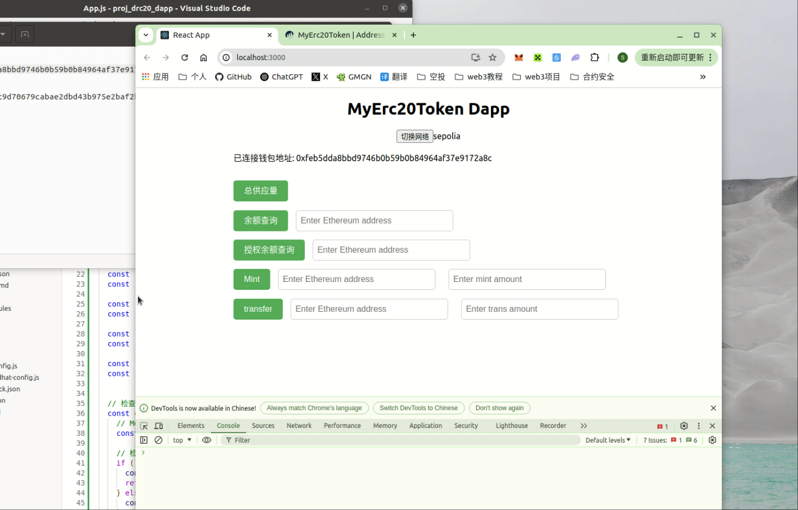
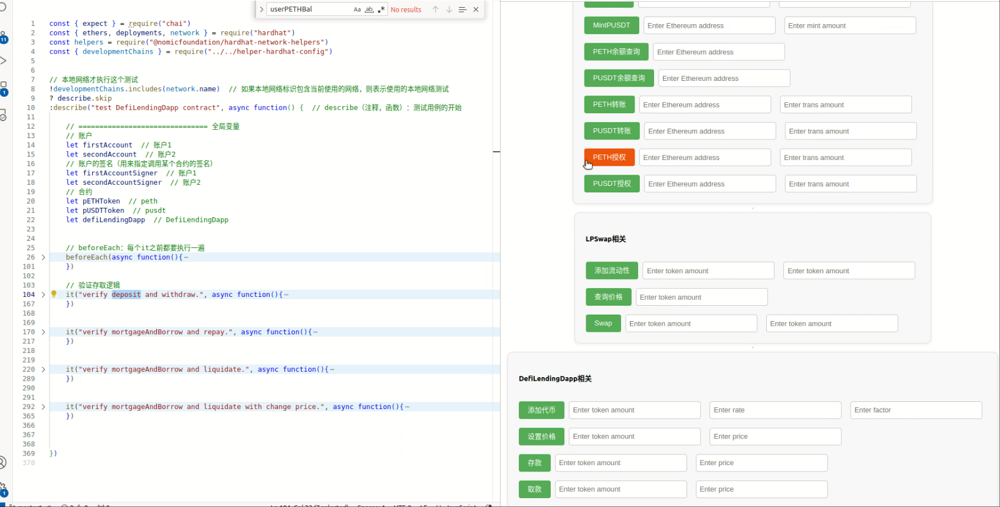

# web3-dapp-project
web3做的一些项目，使用的技术栈有 solidity-hardhat-react 

## Solidity-Hardhat-React-ERC20-Dapp
使用 Solidity、Hardhat、React 相关技术开发一款ERC20 Dapp

#

介绍视频：[Solidity-Hardhat-React-ERC20-Dapp](https://www.bilibili.com/video/BV1MYdgY4EXC/?vd_source=de5312dbb510be6822ca2b487a8c4773)

# Solidity-Hardhat-React-DLP（DeFi Lending Platform）-Dapp
使用 Solidity、Hardhat、React 相关技术开发一款DeFi Lending Platform（去中心化借贷平台）

#

介绍视频：[Solidity-Hardhat-React-DLP（DeFi Lending Platform）-Dapp](https://www.bilibili.com/video/BV1zu5szWE3d/?spm_id_from=333.1387.homepage.video_card.click)

